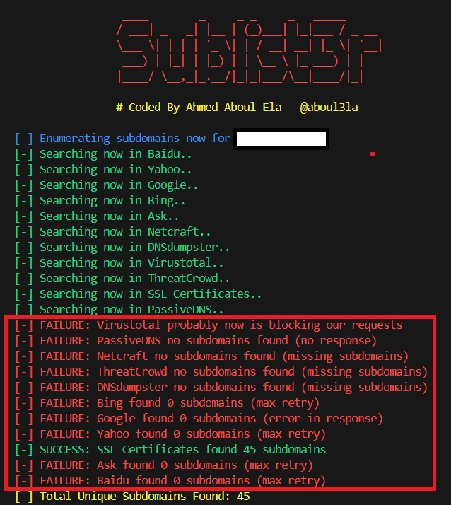
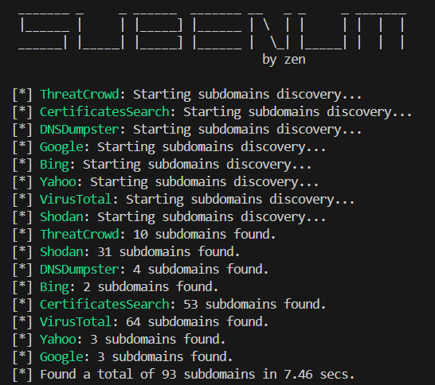

# Sublist3r is dead, so I rebuilt it and added it to pypi


A few months ago, I started pen-testing companies for bounties again. The first step of any cybersecurity audit is **recon**naissance, and a major part of that is **finding subdomains**. To do this, there's a well-known tool called **Sublist3r**, which searches for subdomains from public sources. After using the tool for a while, I noticed it missed a subdomain listed on VirusTotal. Upon debugging, I discovered that **only one** of the tool's APIs was functioning properly, while the others were **completely outdated**.





First, I started reimplementing the APIs that were broken, but after a few lines of code, I realized it would be much easier to rewrite the whole tool. I began with the **VirusTotal API**, which now requires an API key because the web endpoint is **no longer accessible without captchas**. Then, I discovered a **Shodan API** call I wasn’t aware of that allows anyone to list subdomains. After that, I added some old-school websites to find subdomains: **crt.sh**, **DNSDumpster**, and **ThreatCrowd**. Finally, I wrote the search engine modules for **Google**, **Yahoo**, and **Bing**. With a small layer of multithreading, I ended up with a tool that can find lots of subdomains in just **a few seconds**.





But that's not the end. After finishing the tool, I decided to add it to the PyPI package manager so that anyone can install **subenum** with the following command:
> pip install subenum

Once installed, you can access the **subenum** command directly from your terminal. To test the tool, simply run the following command:
> subenum example.com

This will print all the subdomains. If you want to **save them to a text file**, you can add the following parameter:
> subenum example.com -o subdomains.txt

Or you can use it directly in python:
```
from subenum import SubEnum
VIRUSTOTAL_API_KEY = 'XXXX'
SHODAN_API_KEY = 'YYYY'
subdomains = SubEnum(vt_api_key=VIRUSTOTAL_API_KEY, shodan_api_key=SHODAN_API_KEY).get_subdomains("example.com")
for subdomain in subdomains:
    print(subdomain)
```

The tool works without any API keys, but if you want to maximize your results, you can add them in a `.env` file:
```
VIRUSTOTAL_API_KEY=XXXXXXXXXXXXXXXXXXXXXXXXXXXXXXXXXXXXXXXXXXXXX
SHODAN_API_KEY=YYYYYYYYYYYYYYYYYYYYYYYYYYYY
```
It's free to make an account on Shodan or VirusTotal.

You can check the source-code [here](https://github.com/42zen/subenum)


By [Zen](https://www.linkedin.com/in/mathias-bochet/)

