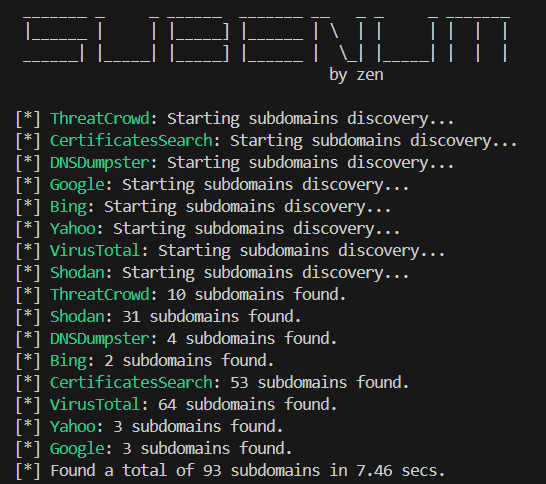

# subenum


## Introduction
**[Sublist3r](https://github.com/aboul3la/Sublist3r)** is no longer actively maintained and hasn't received updates in several years. Many of its functionalities doesn't work anymore. As a replacement, **subenum** offers a fast and robust up-to-date tool for discovering subdomains passively.





## Features

### Websites
- crt.sh
- ThreatCrowd.org
- DNSDumpster.com

### Apis
- Shodan
- VirusTotal

### Search Engine
- Google
- Bing
- Yahoo


## How to install

You can install **subenum** directly from pip with the following command:
> pip install subenum

Or you can install it directly from the repository:
> git clone https://github.com/42zen/subenum


## How to use

When installed you can **scan a domain** and **store the results** on a file with a simple command:
> subenum example.com -o subdomains.txt

You can also create a .env file with the following values to specify apis keys:
```
VIRUSTOTAL_API_KEY=XXXXXXXXXXXXXXXXXXXXXXXXXXXXXXXXXXXXXXXXXXXXX
SHODAN_API_KEY=YYYYYYYYYYYYYYYYYYYYYYYYYYYY
```

Or using the **python library**:
```
from subenum import SubEnum
VIRUSTOTAL_API_KEY = 'XXXX'
SHODAN_API_KEY = 'YYYY'
subdomains = SubEnum(vt_api_key=VIRUSTOTAL_API_KEY, shodan_api_key=SHODAN_API_KEY).get_subdomains("example.com")
for subdomain in subdomains:
    print(subdomain)
```


## Credits

- [Mathias Bochet](https://www.linkedin.com/in/mathias-bochet/) (aka [Zen](https://github.com/42zen/)) - Author
- [Ahmed Aboul-Ela](https://x.com/aboul3la) (aka [aboul3la](https://github.com/aboul3la/)) - Author of the original sublist3r tool